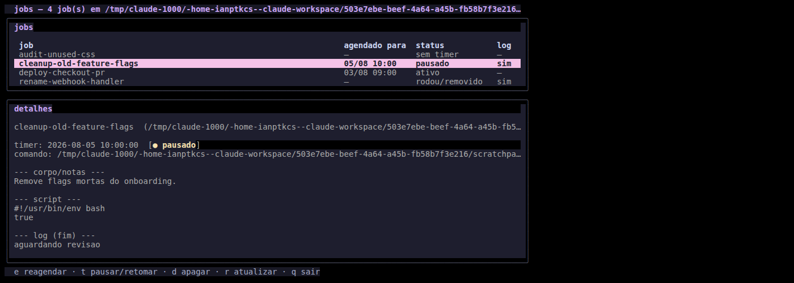
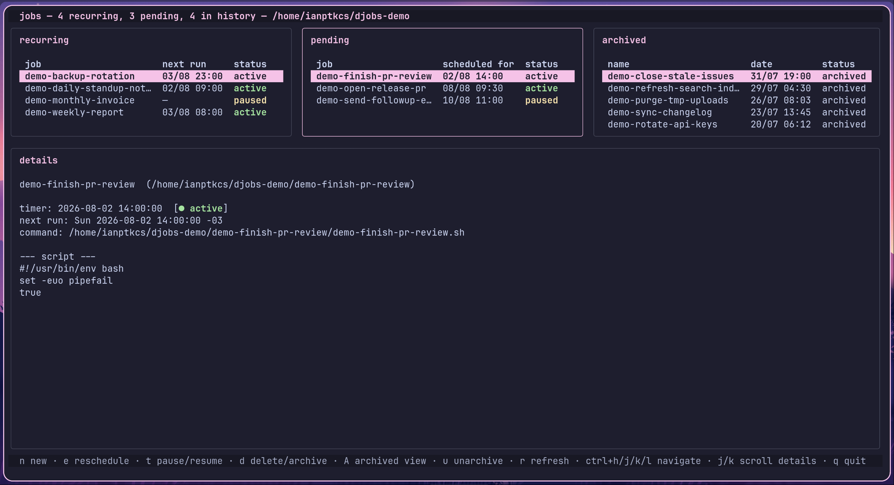

# Dank Jobs

[](https://ko-fi.com/ianptkcs)

A [Bubble Tea](https://github.com/charmbracelet/bubbletea) TUI for browsing and
managing "jobs" scheduled as systemd user timers — a lightweight pattern for
deferring CLI/git work (finish this branch tonight, open that PR tomorrow at
9am) or scheduling something recurring (a daily digest, a weekly cleanup)
without needing a full task queue.

Styled with the official [Catppuccin](https://github.com/catppuccin/catppuccin)
Mocha palette, following the project's
[semantic color guidelines](https://github.com/catppuccin/catppuccin/blob/main/docs/style-guide.md) —
red for errors, yellow for paused/warning states, green for active ones, blue
for a resolved/informational state, mauve as the primary accent — via
[`catppuccin/go`](https://github.com/catppuccin/go) for the panels/table and
[`huh`](https://github.com/charmbracelet/huh)'s built-in Catppuccin theme for
the reschedule/delete dialogs. Layout is patterned after
[dgop](https://github.com/AvengeMedia/dgop)'s bordered-panel Bubble Tea style.



The header bar reports the recurring/pending/history counts and the jobs
directory currently in effect (`~/jobs` by default, or `DJOBS_JOBS_DIR` if
set) — a quick sanity check for which directory djobs is actually reading
from.

Jobs are split across three equal-width side-by-side panels —
**recurring** (has a timer and repeats), **pending** (one-shot, still on
an active or paused timer), and **history** (resolved) — plus a
**details** panel below all three, navigated
neovim-split-style with `Ctrl+h/j/k/l`: the focused panel's border lights
up. A recurring job stays in its own panel — including while its last run
shows **failed** — for as long as its timer exists, since the timer keeps
firing regardless of one bad run. A one-shot job's history status
distinguishes **done** (ran, self-removed its timer — the convention's
job scripts only reach that step on success), **failed** (fired but the
service unit shows `ActiveState=failed`), and **removed** (its schedule was
deleted, or it was never scheduled, before ever running). Each side panel
caps at 8 visible rows regardless of terminal height, scrolling past that.

Pressing `A` swaps the history panel into an **archived** view instead of
deleting a job for good — `d` offers Archive as well as Delete forever, and
an archived job's directory just moves under `~/jobs/.archive/<name>/`
(invisible to the normal panels) until `u` unarchives it back.



**details** shows everything djobs knows about the selected job: its
directory, the timer's schedule/status and next elapse time (recurring and
pending jobs only), the `<name>*body*.txt` notes and the job script's
contents (both read straight from disk), and the last 25 lines of
`<name>.log` if it exists. `j`/`k`/arrows scroll it one line at a time when
it's focused.

## The job convention

Each job lives in its own directory under `~/jobs/<name>/`:

- `<name>.sh` — the script that does the actual work
- `<name>.log` — output log (populated by the systemd service's stdout/stderr redirect)
- `<name>*body*.txt` — optional freeform notes (e.g. a PR body) shown in the detail panel

Scheduling is a pair of **systemd user units**, `~/.config/systemd/user/<name>.timer`
and `<name>.service`, using `OnCalendar=` + `Persistent=true` — so a run missed
because the machine was asleep or off fires as soon as it's back, unlike plain cron.

djobs discovers a job whenever a `~/jobs/<name>/` directory and a `<name>.timer`
unit share the same name — no extra tagging required. A job with no matching timer
(already run, or never scheduled) still shows up if it has a log or script, just
without a schedule.

```
~/jobs/kiwi-pr/
  kiwi-pr.sh
  kiwi-pr.log
  kiwi-pr-body.txt

~/.config/systemd/user/
  kiwi-pr.timer
  kiwi-pr.service
```

`DJOBS_JOBS_DIR` / `DJOBS_SYSTEMD_DIR` override the two directories
above, if you want to point djobs somewhere other than `~/jobs` and
`~/.config/systemd/user`.

A job repeats instead of running once by giving it a recurring
`OnCalendar=` — Daily/Weekly/Monthly use systemd's own native recurring
expressions (nothing further to manage), and a custom day-interval cycle
(e.g. "run, wait 2 days, run, wait 4, run, wait 5, repeat") is tracked via
a `<name>.recur` sidecar and a self-rescheduling tail in the script instead
of the usual self-deleting one. See [instructions.md](instructions.md) for
the exact formats.

Panel/header titles and the focused-panel border use whatever accent color
is currently configured in an installed
[DankMaterialShell](https://github.com/AvengeMedia/DankMaterialShell) (read
from `~/.config/DankMaterialShell/settings.json` and the Catppuccin
`theme.json` it references — `DJOBS_DMS_SETTINGS` overrides that path).
Without DMS, or with a non-Catppuccin DMS theme, it falls back to a
Catppuccin Mocha accent picked via `DJOBS_ACCENT` (any of `rosewater`,
`flamingo`, `pink`, `mauve`, `red`, `maroon`, `peach`, `yellow`, `green`,
`teal`, `sky`, `sapphire`, `blue`, `lavender` — defaults to `mauve`).

See [instructions.md](instructions.md) for the full convention — useful if
you (or an AI agent) want to write a job by hand instead of using djobs'
own `n` create flow below.

## Install

Requires Go 1.26+.

```bash
git clone https://github.com/ianptkcs/djobs.git
cd djobs
go build -o djobs .
```

Drop the resulting binary on your `PATH`.

## Usage

```bash
./djobs
```

| Key                 | Action                                          |
| ------------------- | ------------------------------------------------ |
| `n`                 | Create a new job (pick one-shot or a recurrence) |
| `e`                 | Reschedule the selected job                     |
| `t`                 | Pause / resume its timer                        |
| `d`                 | Archive, or delete forever                      |
| `A`                 | Toggle the history panel into an archived view  |
| `u`                 | Unarchive the selected job (while in that view) |
| `r`                 | Refresh the list                                |
| `q`                 | Quit                                             |
| `ctrl+h`/`ctrl+l`   | Move focus one panel left/right (recurring/pending/history) |
| `ctrl+j`/`ctrl+k`   | Move focus down into details, and back up       |
| `j`/`k`, `↓`/`↑`     | Move within the focused table, or scroll details  |
| `g`/`G`             | Jump to first/last job                           |
| `ctrl+u`/`ctrl+d`   | Half-page up/down                                |

`u`/`d` alone would also be half-page up/down in a plain bubbles table, but
they're remapped here (to unarchive and archive/delete) — use `ctrl+u`/
`ctrl+d` for half-page up/down instead. All four of `ctrl+h/j/k/l` are
no-ops when there's no pane in that direction, same as vim-tmux-navigator
(e.g. `ctrl+l` from history, or `ctrl+k` from a side panel).

## IPC

For scripting or other tools (e.g. a status-bar widget), `djobs` also
exposes a non-interactive `ipc` subcommand, in the same spirit as `dcal`'s
own `dcal ipc <method> --json`:

```bash
djobs ipc jobs.list --json                  # every discovered job
djobs ipc jobs.list pending=true --json     # pending + recurring (still scheduled)
djobs ipc jobs.list pending=false --json    # only history
djobs ipc jobs.next --json                  # soonest active *one-shot* pending job, or null
```

Each job's JSON also carries a `recurring` field, so a consumer can tell a
still-scheduled recurring job apart from a one-shot one under
`pending=true`. `jobs.next` deliberately excludes recurring jobs — it
answers "what one-off thing is coming up next", not "what's part of an
ambient repeating schedule". Output otherwise reuses the same
status/schedule logic as the TUI (`jobs.go`'s `Job` methods), so it never
drifts from what's shown on screen.

## Development

```bash
go test ./...
```

Job discovery, toggling, rescheduling and deletion are covered against a
disposable fixture job + systemd timer that each test creates and tears down
itself (`jobs_test.go`) — it never touches a real scheduled job.

## Changelog

See [CHANGELOG.md](CHANGELOG.md) for released versions, and
[CONTRIBUTING.md](CONTRIBUTING.md#versioning-and-changelog) for the
versioning policy.

## Support

- **Global**: [ko-fi.com/ianptkcs](https://ko-fi.com/ianptkcs)
- **Brazil (Pix)**: scan the QR below or copy the code

  

  ```
  00020126580014BR.GOV.BCB.PIX01365ad933b0-dcdc-4525-a736-0759902aeec65204000053039865802BR5925Ian Patrick da Costa Soar6009SAO PAULO62140510tQA85x6Dov63041FB6
  ```

## License

[GNU AGPL-3.0](LICENSE) — free and open source. If you run a modified
version of this project, including as a network service, you must also
make your modified source available under the same license.
