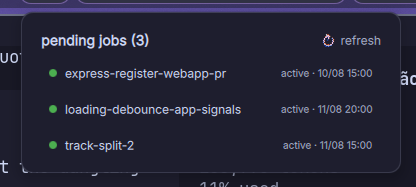

<div align="center">

# Tabela Jobs

[English](README.md) · **Português**

[](go.mod)
[](LICENSE)
[](https://github.com/charmbracelet/bubbletea)
[](https://github.com/TabelaDev/tabelatuiui)

[](https://ko-fi.com/ianptkcs)

</div>

---

Uma TUI [Bubble Tea](https://github.com/charmbracelet/bubbletea) pra navegar e
gerenciar "jobs" agendados como systemd user timers — um padrão leve pra adiar
trabalho de CLI/git (terminar essa branch hoje à noite, abrir aquele PR amanhã
às 9h) ou agendar algo recorrente (um digest diário, uma limpeza semanal) sem
precisar de uma fila de tarefas completa.

Estilizado com a paleta oficial
[Catppuccin](https://github.com/catppuccin/catppuccin) Mocha, seguindo o
[guia de cores semânticas](https://github.com/catppuccin/catppuccin/blob/main/docs/style-guide.md)
do projeto — vermelho pra erro, amarelo pra pausado/aviso, verde pra ativo, azul
pra estado resolvido/informativo, mauve como accent principal — via
[`catppuccin/go`](https://github.com/catppuccin/go) nos painéis/tabela e o tema
Catppuccin embutido do [`huh`](https://github.com/charmbracelet/huh) nos diálogos
de reagendamento/exclusão. O layout segue o estilo de painéis com borda do
[dgop](https://github.com/AvengeMedia/dgop).

O tema e o chrome compartilhado (header/footer/panels, padding ANSI-aware, os
helpers de `ipc ... --json`) vêm da
[`tabelatuiui`](https://github.com/TabelaDev/tabelatuiui), a lib de UI
compartilhada dos meus TUIs Bubble Tea.


A barra de header informa as contagens de recorrentes/pendentes/histórico e o
diretório de jobs em vigor (`~/jobs` por padrão, ou `TJOBS_JOBS_DIR` se
definido) — uma conferência rápida de qual diretório o tjobs está realmente
lendo.

Os jobs ficam divididos em três painéis lado a lado de largura igual —
**recorrentes** (tem timer e repete), **pendentes** (one-shot, ainda num timer
ativo ou pausado) e **histórico** (resolvidos) — mais um painel de **detalhes**
abaixo dos três, navegados no estilo split do neovim com `Ctrl+h/j/k/l`: a borda
do painel focado acende. Um job recorrente fica no painel dele — inclusive
enquanto a última execução aparece como **failed** — enquanto o timer existir, já
que o timer continua disparando independente de uma execução ruim. O status de
histórico de um job one-shot distingue **done** (rodou e removeu o próprio
timer — os scripts da convenção só chegam nesse passo em caso de sucesso),
**failed** (disparou mas a unit de serviço mostra `ActiveState=failed`) e
**removed** (o agendamento foi apagado, ou nunca existiu, antes de rodar). Cada
painel lateral mostra no máximo 8 linhas, independente da altura do terminal, e
rola daí em diante.

`a` troca o painel de histórico por uma visão de **arquivados** em vez de apagar
um job pra sempre — o `d` oferece Arquivar além de Apagar pra sempre, e o
diretório de um job arquivado só se move pra `~/jobs/.archive/<nome>/`
(invisível pros painéis normais) até o `u` desarquivá-lo.


Também dá pra agir em lote — `space` marca/desmarca o job sob o cursor: uma linha
marcada fica destacada (negrito, fundo tingido, `*` antes do nome) e o título do
painel mostra a contagem. Aí o `d` oferece Arquivar/Apagar pra sempre pra
**todos** os jobs marcados daquele painel de uma vez (ainda com o modal de
confirmação). Sem marcar nada, `A` arquiva todos os jobs do painel focado e `D`
apaga todos pra sempre — os dois já vêm com a escolha pré-selecionada no mesmo
modal, então um Enter confirma. `esc` limpa as marcas. As marcas são por painel,
então nunca vazam entre recorrentes/pendentes/histórico.

**detalhes** mostra tudo que o tjobs sabe do job selecionado: o diretório, o
agendamento/status do timer e o próximo disparo (só pra recorrentes e
pendentes), as notas em `<nome>*body*.txt` e o conteúdo do script (ambos lidos
direto do disco), e as últimas 25 linhas de `<nome>.log`, se existir. `j`/`k`/
setas rolam uma linha por vez quando ele está focado.

## A convenção de job

Cada job vive no diretório próprio, em `~/jobs/<nome>/`:

- `<nome>.sh` — o script que faz o trabalho de fato
- `<nome>.log` — log de saída (populado pelo redirect de stdout/stderr do serviço systemd)
- `<nome>*body*.txt` — notas livres opcionais (ex.: o body de um PR), exibidas no painel de detalhes

O agendamento é um par de **systemd user units**,
`~/.config/systemd/user/<nome>.timer` e `<nome>.service`, usando `OnCalendar=` +
`Persistent=true` — então uma execução perdida porque a máquina estava dormindo
ou desligada dispara assim que ela volta, diferente do cron puro.

O tjobs descobre um job sempre que um diretório `~/jobs/<nome>/` e uma unit
`<nome>.timer` compartilham o mesmo nome — sem tag extra nenhuma. Um job sem
timer correspondente (já rodou, ou nunca foi agendado) ainda aparece se tiver log
ou script, só sem agendamento.

```
~/jobs/<nome>/
  <nome>.sh
  <nome>.log
  <nome>-body.txt

~/.config/systemd/user/
  <nome>.timer
  <nome>.service
```

`TJOBS_JOBS_DIR` / `TJOBS_SYSTEMD_DIR` sobrescrevem os dois diretórios acima, se
você quiser apontar o tjobs pra outro lugar que não `~/jobs` e
`~/.config/systemd/user`.

Um job repete em vez de rodar uma vez quando recebe um `OnCalendar=` recorrente —
Diário/Semanal/Mensal usam as expressões recorrentes nativas do systemd (nada
mais pra gerenciar), e um ciclo customizado de intervalo em dias (ex.: "roda,
espera 2 dias, roda, espera 4, roda, espera 5, repete") é rastreado por um
sidecar `<nome>.recur` e um rabo auto-reagendável no script, em vez do
auto-removível de sempre. Ver [instructions.md](instructions.md) pros formatos
exatos.

Escolher **Manual (sem agendamento)** ao criar um job escreve o script e a unit
de serviço, mas nenhum timer — ele nunca dispara sozinho, fica no painel de
pendentes com status `manual`, e só roda quando você aperta `x`. O `x` também
funciona em qualquer job: ele inicia o serviço na hora, então dá pra disparar um
job agendado antes do tempo sem mexer no agendamento (um one-shot então termina e
se auto-remove como de costume).

Os títulos de painel/header e a borda do painel focado usam o accent atualmente
configurado num
[DankMaterialShell](https://github.com/AvengeMedia/DankMaterialShell) instalado
(lido do `~/.config/DankMaterialShell/settings.json` e do `theme.json`
Catppuccin que ele referencia — `TJOBS_DMS_SETTINGS` sobrescreve esse caminho).
Sem o DMS, ou com um tema DMS não-Catppuccin, cai num accent Catppuccin Mocha
escolhido via `TJOBS_ACCENT` (qualquer um entre `rosewater`, `flamingo`, `pink`,
`mauve`, `red`, `maroon`, `peach`, `yellow`, `green`, `teal`, `sky`, `sapphire`,
`blue`, `lavender` — padrão `mauve`).

Ver [instructions.md](instructions.md) pra convenção completa — útil se você (ou
um agente de IA) quiser escrever um job à mão em vez de usar o fluxo de criação
`n` do próprio tjobs, abaixo.

## Widget do DMS

Se você usa o
[DankMaterialShell](https://github.com/AvengeMedia/DankMaterialShell), o
diretório `dms-plugin/` é um widget de dankbar que mostra o próximo job pendente
e lista tudo que ainda está agendado. Faça um symlink pro diretório de plugins do
DMS (reinicie o DMS depois de mudar o link):

```bash
ln -s "$(pwd)/dms-plugin" ~/.config/DankMaterialShell/plugins/tjobs
```

O widget lê duas configurações (DMS Settings → Plugins → tjobs): **Max name
width** limita a largura que um nome de job pode ter na pill da barra antes de
ser cortado com "…" (`0` = sem limite — útil pra nomes longos como
`express-register-webapp-pr`), e **Refresh interval** controla de quanto em
quanto tempo ele reconsulta o tjobs.



## Instalação

Requer Go 1.26+.

```bash
git clone https://github.com/ianptkcs/tabelajobs.git
cd tabelajobs
go build -o tjobs .
```

Coloque o binário resultante no seu `PATH`.

## Uso

```bash
./tjobs
```

| Tecla                | Ação                                                     |
| -------------------- | -------------------------------------------------------- |
| `n`                  | Cria um job novo (one-shot, recorrência ou manual)        |
| `x`                  | Roda o job selecionado agora (ignora o timer dele)        |
| `e`                  | Reagenda o job selecionado                                |
| `t`                  | Pausa / retoma o timer                                    |
| `d`                  | Arquiva, ou apaga pra sempre (todos os marcados, se houver) |
| `A`                  | Arquiva todos os jobs do painel focado                    |
| `D`                  | Apaga pra sempre todos os jobs do painel focado           |
| `space`              | Marca / desmarca o job selecionado                        |
| `esc`                | Limpa todas as marcas                                     |
| `a`                  | Alterna o painel de histórico pra visão de arquivados     |
| `u`                  | Desarquiva o job selecionado (nessa visão)                |
| `r`                  | Atualiza a lista                                          |
| `q`                  | Sai                                                       |
| `ctrl+h`/`j`/`k`/`l` | Move o foco entre painéis/detalhes (uma única ação "nav") |
| `j`/`k`, `↓`/`↑`     | Move dentro da tabela focada, ou rola os detalhes         |
| `g`/`G`              | Vai pro primeiro/último job                               |
| `ctrl+u`/`ctrl+d`    | Meia página acima/abaixo                                  |

`u`/`d` sozinhos também seriam meia página acima/abaixo numa tabela bubbles
comum, mas aqui eles foram remapeados (pra desarquivar e arquivar/apagar) — use
`ctrl+u`/`ctrl+d` pra meia página. Os quatro `ctrl+h/j/k/l` são no-op quando não
existe painel naquela direção, igual ao vim-tmux-navigator (ex.: `ctrl+l` do
histórico, ou `ctrl+k` de um painel lateral).

## IPC

Pra scripts ou outras ferramentas (ex.: um widget de barra de status), o `tjobs`
também expõe um subcomando `ipc` não-interativo, no mesmo espírito do
`dcal ipc <método> --json`:

```bash
tjobs ipc jobs.list --json                  # todo job descoberto
tjobs ipc jobs.list pending=true --json     # pendentes + recorrentes (ainda agendados)
tjobs ipc jobs.list pending=false --json    # só histórico
tjobs ipc jobs.next --json                  # o pendente *one-shot* ativo mais próximo, ou null
```

O JSON de cada job também traz um campo `recurring`, então quem consome
consegue distinguir um recorrente ainda agendado de um one-shot dentro de
`pending=true`. O `jobs.next` exclui recorrentes de propósito — ele responde "que
coisa pontual vem a seguir", não "o que faz parte de um agendamento repetitivo de
fundo". No resto, a saída reusa a mesma lógica de status/agendamento da TUI (os
métodos de `Job` em `jobs.go`), então ela nunca diverge do que aparece na tela.

## Configuração

Opcional, em `~/.config/tjobs/config.toml`. Sem o arquivo o tjobs roda nos
defaults abaixo; com ele, só as chaves presentes são sobrescritas — não precisa
copiar o arquivo inteiro pra mudar uma linha. `f5` recarrega ele (e o
`keybindings.json`) sem reiniciar.

```toml
[layout]
schedule_col_width = 13  # largura do conteúdo, antes do padding da própria tabela
status_col_width   = 8
jobs_row_percent   = 45  # fatia da altura do corpo pros três painéis laterais
max_visible_rows   = 8   # teto por painel lateral, não importa a altura do terminal
min_panel_width    = 20

[timing]
run_now_reload_delay = "3s"  # espera depois do "rodar agora" antes de reescanear
```

As duas larguras de coluna só podem ser aumentadas: o decorador da célula de
status deriva os offsets dele delas, então um valor mais estreito que o próprio
texto do header pintaria as colunas erradas. Qualquer coisa menor volta pro
default.

`TJOBS_JOBS_DIR` e `TJOBS_SYSTEMD_DIR` continuam variáveis de ambiente em vez de
chaves de config — elas apontam pra locais do sistema, não pra preferências do
usuário.

## Desenvolvimento

```bash
go test ./...
```

Descoberta, toggle, reagendamento e exclusão de job são cobertos contra um job de
fixture descartável + timer systemd que cada teste cria e destrói por conta
própria (`jobs_test.go`) — nunca encosta num job agendado de verdade.

## Changelog

Ver [CHANGELOG.md](CHANGELOG.md) pras versões lançadas, e
[CONTRIBUTING.pt-BR.md](CONTRIBUTING.pt-BR.md) pra política de versionamento.

## Apoie o projeto

- **Global**: [ko-fi.com/ianptkcs](https://ko-fi.com/ianptkcs)
- **Brasil (Pix)**: escaneie o QR abaixo ou copie o código

  

  <details><summary>Código Pix (copiar)</summary>

  ```
  00020126580014BR.GOV.BCB.PIX01365ad933b0-dcdc-4525-a736-0759902aeec65204000053039865802BR5925Ian Patrick da Costa Soar6009SAO PAULO62140510tQA85x6Dov63041FB6
  ```

  </details>

## Licença

[GNU AGPL-3.0](LICENSE) — livre e open source. Se você rodar uma versão
modificada deste projeto, inclusive como serviço de rede, também precisa
disponibilizar o código-fonte modificado sob a mesma licença.
